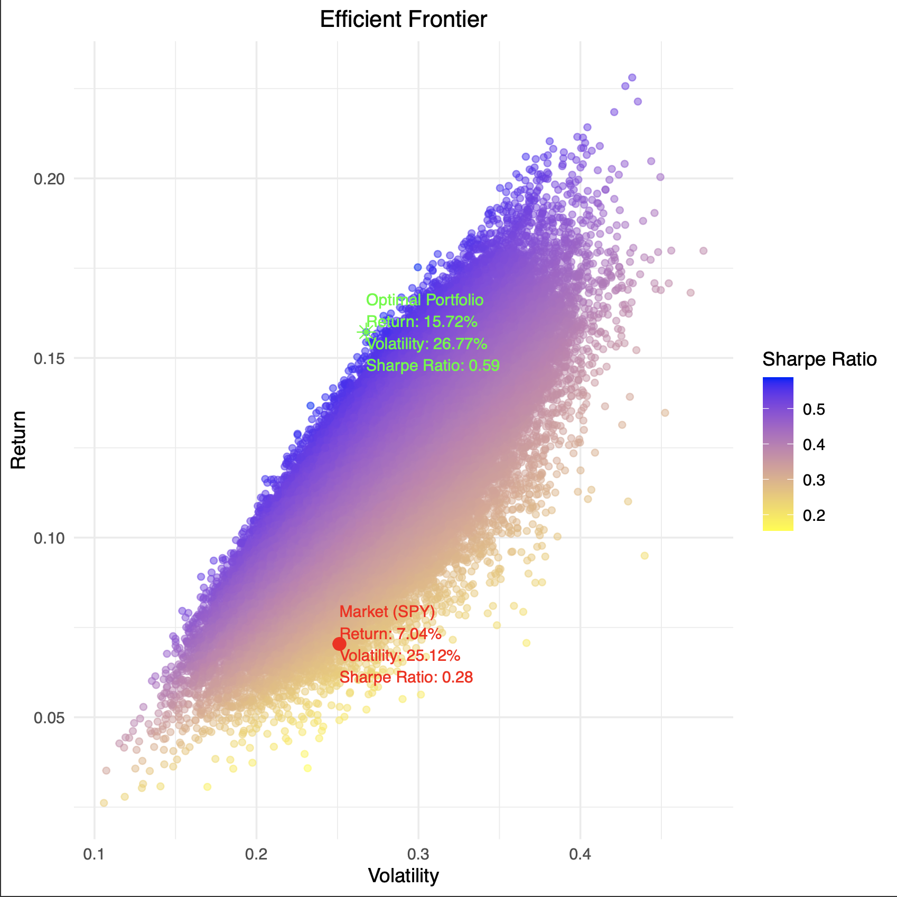

# Portfolio Optimization with Monte Carlo Simulations

This repository serves as an investment analysis tool, employing 100,000 Monte Carlo simulations designed to optimize asset allocation strategies using historical market data to enhance risk-adjusted returns.

## Sample Output

Below is an example output that exhibits return and volatility of the 100,000 asset portfolios ran against the market representation (SPY) and provides metrics for the optimized portfolio's performance along with the market's performance.



## Directory Structure

```
Monte_Carlo_Portfolio_Optimization/
├── src/
│   ├── Main.R
│   ├── Monte_Carlo_Simulation.R
│   ├── Portfolio_Optimization.R
│   └── Utility_Functions.R
│
├── test/
│   ├── test_Monte_Carlo_Simulation.R
│   ├── test_Portfolio_Optimization.R
│   └── test_Utility_Functions.R
│
├── Monte_Carlo_Example_Output.png
├── .gitignore
├── LICENSE
└── README.md
```

## Installation

To get started with this portfolio optimization tool in R, follow these steps:

1. **Clone the repository**:
   ```bash
   git clone https://github.com/peterajhgraham/Monte_Carlo_Portfolio_Optimization.git
   ```
2. **Navigate to the repository's directory**:
   ```bash
   cd Monte_Carlo_Portfolio_Optimization
   ```
3. **Install the required R packages**:
   ```bash
   "install.packages(c('quantmod', 'data.table', 'Matrix', 'ggplot2', 'PerformanceAnalytics'))"
   ```
## Usage

1. **Execute the Main.R script to perform the portfolio optimization simulation**:
  ```bash
  Rscript src/Main.R
  ```
